<!-- Stats GitHub et langages les plus utilisés (générés par GitHub Actions, voir .github/workflows/github-stats.yml) -->

  
  

<!-- Série de contributions consécutives (streak = nombre de jours d'affilée avec au moins 1 contribution) -->
<!--

  

-->
